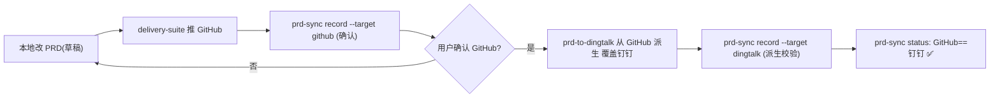

# PRD 三端版本同步（prd-sync · GitHub 为主文档）

## 核心模型：本地草稿 → GitHub(已确认闸门) → 钉钉(派生镜像)

```
本地 PRD.html (草稿，可能领先)  ──确认推送──►  GitHub Pages (已确认最终版)
                                                    │
                                                    └──派生同步──►  钉钉文档 (只读镜像)
```

- **本地 HTML 只是草稿**：随时在改，版本号可能领先于线上，不能作为对外发布的直接来源。
- **GitHub Pages 是「已确认最终版」**：只有用户确认后，本地草稿才被推送上来（经 `delivery-suite`）。
- **钉钉文档是「从 GitHub 派生的镜像」**：永不直接从本地草稿推钉钉；同步时以 GitHub 已确认版本为基准（`record --target dingtalk` 会实时抓取 GitHub raw 校验，若本地草稿仍领先则拒绝派发）。
- 版本号：各端各自从自身内容提取（`<meta name="prd-version">` 或变更记录末行），保证三端显示同一版本号。

## manifest 结构（项目根目录 `prd-publish-manifest.json`）

```json
{
  "prds": [
    {
      "name": "绿韵家App数商服务模块PRD",
      "file": "lvyunjia-shushang-prd.html",
      "local_version": "V0.4",
      "github": {
        "url": "https://ddyuan-spec.github.io/lvyunji/lvyunjia-shushang-prd.html",
        "raw_url": "https://raw.githubusercontent.com/ddyuan-spec/lvyunji/gh-pages/lvyunjia-shushang-prd.html",
        "version": "V0.4",
        "synced_at": "2026-08-18T16:46:00+08:00"
      },
      "dingtalk": {
        "node_id": "Amq4vjg89nwK60nxHxqdXYbpW3kdP0wQ",
        "url": "https://alidocs.dingtalk.com/i/nodes/Amq4vjg89nwK60nxHxqdXYbpW3kdP0wQ",
        "version": "V0.4",
        "synced_at": "2026-08-18T16:46:00+08:00"
      }
    }
  ]
}
```

## 工作流（GitHub 主文档 + 两步验收）

用户约定的交付顺序：**本地改草稿 → 确认 → 推 GitHub → 用户确认 GitHub OK → 同步钉钉（从 GitHub 派生）**。



### 命令

```bash
# 0) 首次注册（把现有三端信息写进 manifest）
python scripts/prd_sync.py register \
  --name "绿韵家App数商服务模块PRD" \
  --file lvyunjia-shushang-prd.html \
  --github-url "https://ddyuan-spec.github.io/lvyunji/lvyunjia-shushang-prd.html" \
  --github-raw "https://raw.githubusercontent.com/ddyuan-spec/lvyunji/gh-pages/lvyunjia-shushang-prd.html" \
  --dingtalk-node "Amq4vjg89nwK60nxHxqdXYbpW3kdP0wQ" \
  --dingtalk-url "https://alidocs.dingtalk.com/i/nodes/Amq4vjg89nwK60nxHxqdXYbpW3kdP0wQ"

# 1) 确认推完 GitHub 后记录（本地草稿 -> 已确认版）
python scripts/prd_sync.py record --target github --file lvyunjia-shushang-prd.html

# 2) 用户确认 GitHub OK 后，同步钉钉（prd-to-dingtalk 从 GitHub 派生）后记录
#    record 会实时抓取 GitHub raw，若本地草稿仍领先则拒绝，确保钉钉=确认版
python scripts/prd_sync.py record --target dingtalk --file lvyunjia-shushang-prd.html --node <nodeId>

# 3) 随时查三端状态：权威一致性 = GitHub(已确认) == 钉钉(已同步)
python scripts/prd_sync.py status
python scripts/prd_sync.py status --file lvyunjia-shushang-prd.html

# 升级草稿版本号（仅本地，未确认）
python scripts/prd_sync.py bump --version V0.5 --file lvyunjia-shushang-prd.html
```

## 校验逻辑（status）

- **草稿(本地)**：从本地 HTML 提取（`<meta name="prd-version">` 优先，变更记录末行兜底）。
- **已确认(GitHub)**：实时 `urllib` 抓取 `raw_url` 并提取版本（真实校验，不靠记录）。
- **已同步(钉钉)**：取 manifest 中 `dingtalk.version`（钉钉无公开 raw 接口，靠派发时 `record` 写入，可靠）。
- **状态判定**：
  - ✅ 钉钉已追平确认版 = GitHub 版本 == 钉钉版本（权威一致）。
  - ⚠️ 钉钉落后于确认版(需同步) = GitHub != 钉钉（真实漂移，需重派）。
  - ⚠️ 本地草稿领先(未确认) = 本地 != GitHub（提示用户去确认推送，不视为漂移）。

## 与相邻 skill 的关系

- `delivery-suite`：负责 GitHub Pages 推送，推完调本 skill 的 `record --target github`（确认）。
- `prd-to-dingtalk`：负责钉钉推送；**必须从 GitHub 派生**（下载 GitHub raw HTML 转 MD 再覆盖钉钉），推完调 `record --target dingtalk`（派生校验）。
- `pm-master`：路由「推 GitHub」→ delivery-suite、「推钉钉」→ prd-to-dingtalk、「同步/对版本」→ 本 skill。

## 实际核查（manifest 不可信时的兜底，必读）

`status` 依赖 manifest 里的 `version/synced_at`，而 manifest 常常没跟着 `record` 更新（nodeId 换过、版本改过但没记录）→ **status 输出只能当线索，不能当结论**。raw.githubusercontent 也常 TimeoutError 导致 `<fetch-failed>`。真要回答「钉钉同步了没」，用下面三条实测：

### 1) GitHub 侧实测（用 gh api，别用 raw 抓取）
```bash
unset HTTPS_PROXY HTTP_PROXY https_proxy http_proxy GITHUB_TOKEN ALL_PROXY all_proxy
gh api "repos/<owner>/<repo>/contents/<file>?ref=gh-pages" -q '.size'   # 必须 ?ref=gh-pages
stat -c%s <file>            # 本地字节数
```
两边 size 相等即一致；不等即本地未推（或线上领先）。需要看内容再 `-q .content | base64 -d`。

### 2) 钉钉侧实测（回读 outline，比 full read 快且稳）
```bash
dws doc read --node <32位nodeId> --content-format jsonml --scope outline > _o.json
python scripts/dingtalk_outline.py _o.json      # 提取 h1~h4 标题
```
- **必须带 `--content-format jsonml`**，单独用 `--scope` 会报 `code:5 --scope/--tags requires --content-format jsonml`。
- 31 位 legacy nodeId 的 `doc read` 会被硬拒（只能写不能读）→ 32 位才行。
- 判定：拿钉钉标题树和本地 PRD 的章节/页面编号对照，结构对得上才算同步。

### 3) 查「某需求到底有没有钉钉 PRD」
```bash
dws doc +list --page-all --max-items 300 --jq '.nodes[].name' | grep -i "关键字"
```
别默认「有 PRD」，先 list 确认。同名重复文档（PRD(1)(2)(5)(6)(7)…）是历史遗留，只认 manifest 里固定的那个 nodeId。

### 4) 审计时同时看「PRD 有没有覆盖原型最新结构」
三端版本一致 ≠ 内容对得上。常见漂移：原型改了页面结构（如两独立页合并为 Tab 聚合页）但 PRD 章节没动。核对方法：PRD 里 grep 原型里已删除的页面 id（如 `p_invite_detail`），命中即说明 PRD 落后于原型。

## 红线

- **GitHub 是主文档 / 已确认闸门**：钉钉只能从 GitHub 派生，绝不直接从本地草稿推钉钉。
- **本地草稿领先时禁止派钉钉**：`record --target dingtalk` 会拦截（本地 != GitHub 则拒绝）。
- **不要绕开 GitHub 单独编辑钉钉版本**：钉钉是镜像，唯一写入路径 = GitHub 派生。
- 钉钉始终覆盖同一篇（URL 稳定），不要每版新建文档。
- **manifest 过期要顺手修**：发现 nodeId/版本与实际不符，改完同步更新 `prd-publish-manifest.json`，否则下次 status 继续误导。
