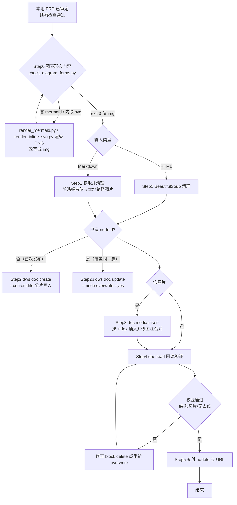

# PRD 推钉钉文档

## 触发条件

当用户提出以下任一请求时调用本 skill：
- "把 PRD 推到钉钉文档"
- "PRD 转钉钉文档"
- "发布到钉钉文档"
- "PRD 推钉钉"
- 任何涉及将本地 `*.html` 或 `*.md` PRD 发布为钉钉在线文档的任务

## 核心目标

把**GitHub 已确认版** PRD 完整、可阅、格式尽量保真地发布到钉钉文档（alidocs），并返回可分享的在线链接。钉钉是 GitHub 的派生镜像，**绝不直接用本地草稿作为源**（本地可能领先、未确认）。同时必须清理冗余剪贴板截图，禁止把 `@image#N:Clipboard_Screenshot.png` 这类占位符写进文档。

## 前置检查

1. 确认 PRD 已通过结构/内容检查（如项目有 `check_prd.py` 或 `prd-suite` 门禁，先跑通）。
2. **确认 GitHub 已确认版是最新**：本地草稿可能领先，但钉钉必须以 GitHub raw 为准。若本地领先 GitHub，应先让用户确认并推送 GitHub 再走本流程（见 `prd-sync` 的 `record --target dingtalk` 守卫）。
3. 确认 PRD 已推送到线上可访问地址（GitHub Pages）——图片**临时**用公网 URL 占位，但 **Step 3 必须逐张换成钉钉内部 OSS 路径**；最终文档里禁止残留任何 `raw.githubusercontent.com` / `github.io` 外链（国内拉取必超时）。
4. 确认本地已安装 `dws` 且钉钉已连接：`dws profile list --format json` 能看到有效 profile。
5. 确认 PRD 中不存在 `@image#N:Clipboard_Screenshot.png`、`clipboard-*.png` 等冗余剪贴板图片引用；若有，必须删除或用真实线上图片替换。
6. 🔴 **跑图表形态预检**：`python scripts/check_diagram_forms.py <prd>.html`（必须 exit 0）。钉钉只认 ``；`<div class="mermaid">`（客户端渲染）与内联 `<svg>` 都会在转换时丢失，最终变成**裸文本**。不通过就先渲染成 PNG 再继续。

### Step 0: 图表形态预检（强制，防「图变裸文本」）

> **2026-09-14 事故**：`lvyunjia-ai-workflow-swimlane.html` 的「泳道总览」用 mermaid.js **客户端渲染**。转换脚本按设计剥离 `<script>`（渲染器没了），但 `.mermaid` 里的**文本**被原样转进 Markdown，于是钉钉文档里出现整段 `flowchart LR / subgraph / -->` 裸文本，图完全丢失。
> **根因不是「skill 没修」**：此前只修了**内联 `<svg>`** 这一类（它被剥离后连文字都不剩）；**mermaid 属于第二类形态**——剥离渲染器后源码文本会留下来当正文，破坏性更大，且旧门禁只看 ``，会**顺着 bug 报告 0 张图**、误判为「纯文字模式 C」。

```bash
python scripts/check_diagram_forms.py <prd>.html        # exit 0 = 可继续；1 = 必须先转 PNG
```

- 检出项：`mermaid` / `echarts` / `chart.js` / `d3` / `vis-network` / `cytoscape` / `plantuml` / `katex|mathjax`（均为客户端渲染，必丢）+ **内联 `<svg>`**（剥离子）。
- 脚本会**先删 HTML 注释与 `<pre>/<code>`**：作者把渲染源留在 `<!-- -->` 备查、或提示词里出现 `flowchart` 字样，都不算风险（`<pre>` 里的代码块钉钉能原样当文本展示，是合法的）。
- **修复路径（一条命令渲染 + 改成 ``）**：
  ```bash
  # 1) 把 HTML 里所有 <div class="mermaid"> 渲染成 PNG（自动探测 chromium + 缓存 mermaid.min.js）
  python scripts/render_mermaid.py --html <prd>.html --out-dir . --prefix <prd名>
  # 2) 把每个 <div class="mermaid">…</div> 替换为（与既有  图同构）
  #    <figure class="flowfig">-1.png" alt="…"><figcaption>图 1 · …</figcaption>
  #      <div class="chain">一行速览：…</div></figure>
  #    mermaid 源码留 <!-- … --> 注释备查（改图时重跑本脚本即可）
  # 3) 重跑 check_diagram_forms.py 必须 exit 0
  # 内联 <svg>（流程图/状态机等手绘图，钉钉不渲染）→ 渲染成 PNG 并原地替换 
  python scripts/render_inline_svg.py --html <prd>.html --out-dir . --prefix <prd名> --replace
  # 默认仅渲染不改动 HTML；--replace 把 <div class="fig"><svg>…</svg></div>
  #   原地改为 <div class="fig">-N.png" alt="…"><div class="fig-cap">…</div></div>
  # 重跑 check_diagram_forms.py 必须 exit 0
  ```
- **超宽图提醒**：`flowchart LR` 多泳道会渲染成 6:1 以上超宽横条，钉钉里缩成一条、文字不可读 → 泳道图一律用 `flowchart TB`（泳道横排，竖版可读）。这是**渲染方向**问题，改前问用户一句。

## 工作流

### 决策表：先判本轮走哪条路（必做，别一上来就全量）

| 本轮改动内容 | 走哪条 | 实际动作 | 耗时 |
|---|---|---|---|
| **只改文字/表格/标题，一张图都没动** | **模式 C 纯文字** | 改动**须先落 GitHub**（未推则先 `delivery-suite` 推线 + 回读 size 一致）→ `--dry-run` 预检 NEW+CHANGED=0 → `--apply`（不产出任何上传命令）→ `--finalize` → 一次 `overwrite` | 秒级 |
| 新增/替换了**部分**图，文字也改 | **模式 A 增量**（默认） | 同上先落 GitHub → `--apply` 只传 CHANGED/NEW 图 → `bash apply.sh` → `--finalize` → `overwrite` | 分钟级 |
| 首次发布 / 无基线 manifest | 模式 A 首推 | 同上，首轮全传建基线 | 较长 |
| 只想知道会变多少、暂不推送 | `--dry-run` | 算指纹，报 REUSE/CHANGED/NEW 占比 | 秒级 |
| 本地已改但**还没推 GitHub** | 先 `delivery-suite` | 钉钉源 = GitHub raw，本地没推则派生出来是旧内容，等于白推 | — |

> 判定口诀：**先 `--dry-run`，看 NEW+CHANGED 是不是 0**。是 0 → 模式 C，一张图都不用传；>0 → 模式 A，只传那几张。
> ⚠️ 顺序固定：`apply` → `--finalize` →（可选）`dry-run` 复验。**finalize 前跑 dry-run 会丢掉已回填的 resourceUrl**。
> 🔴 **全模式前提（2026-09-10 用户裁定）**：本地 HTML 的改动**必须先推 GitHub 并回读校验 size 一致**，钉钉才派生。禁止两种走法：① 本地改完直接生成 MD 推钉钉（源不是已确认版）；② 绕开 GitHub 直接手改钉钉文档（钉钉会领先本地，三端漂移，且下次 overwrite 会被冲掉）。**不存在「钉钉热修」这条路径。**

### 流程总览（Mermaid 文本绘图）

下图与钉钉「文本绘图」使用同一套 Mermaid 语法，可直接粘进钉钉文档转成绘图卡；在支持 Mermaid 的 Markdown 环境（含本 skill 文档）中可直接渲染。



### Step 1: 准备 Markdown 源（必须取自 GitHub 已确认版）

**输入**: GitHub Pages 的 raw HTML（**不是本地草稿**，确保钉钉=已确认版）。

1. 从 `prd-publish-manifest.json` 取该 PRD 的 `github.raw_url`（如 `https://raw.githubusercontent.com/ddyuan-spec/lvyunji/gh-pages/lvyunjia-shushang-prd.html`）。
2. 下载 raw HTML 到临时文件：
   ```bash
   curl -fsSL "<github.raw_url>" -o /tmp/prd_confirmed.html
   ```
3. 用 BeautifulSoup 清理 `<style>`、`<script>`、`<svg>`、`<noscript>` 等不会正确投影到钉钉 Markdown 的标签。
   - ⚠️ 这一步**只清标签、不会救图**：`<script>`（mermaid 渲染器）被清掉后 `<div class="mermaid">` 里的源码文本会原样进入 MD。**动手前先跑 Step 0 门禁**，mermaid/内联 svg 一律先渲染成 PNG 再走到这里。
4. 用 `markdownify` 将正文转为 Markdown；保留图片 `` 或内联图片块，图片 URL 先用线上地址**占位**（后续 Step 3 全部替换）。
5. 运行本 skill 提供的脚本：`python scripts/prd_html_to_dingtalk_md.py /tmp/prd_confirmed.html <prd>.md`。
6. **导出图片清单**（Step 3 的输入）：从生成的 MD 中提取全部图片 URL 与 alt，按顺序存为 `images.json`（`[{"index":0,"url":"...","alt":"..."}]`）。这张表决定后面逐张 `media insert` 的顺序，顺序错则图注错位。
- **红线**：
  - 禁止直接拿本地草稿 HTML 当源（本地可能领先/未确认）。
  - 禁止把 `@image#N:Clipboard_Screenshot.png` 或类似剪贴板占位文本写入输出 Markdown。
  - 禁止把本地绝对路径图片（如 `C:\Users\...\clipboard-xxx.png`）作为图片 URL 发布。

### Step 2: 创建钉钉文档

```bash
dws doc create --name "<文档标题>" --content-file "<prmd.md>" --format json
```

- 标题建议带版本号，如 `绿韵家App数商服务模块PRD-V0.4`。
- `dws` 是 shell 脚本封装，**必须通过 Bash 调用**，不要直接用 Python `subprocess` 调 dws（Windows 会报 WinError 193）。
- 长文会自动按标题边界分片写入；命令返回 `nodeId` 与 `chunksWritten`。

### Step 2b: 覆盖已存在文档（默认推荐，URL 永久稳定）

> 用户约定：钉钉**始终覆盖同一篇**，不每版新建文档，避免散落多个 nodeId、漏推某一篇。

若已存在该 PRD 的钉钉文档（manifest 里有 `node_id`），用 `update --mode overwrite` 覆盖，而非 `create`：

```bash
# 先做 Step1 生成 <prd>.md，再覆盖同一篇
dws doc update --node "<已有 nodeId>" --content-file "<prd>.md" --mode overwrite --yes --format json
```

- 覆盖后文档 URL 不变，内容刷新到最新版本；`nodeId` 不变。
- 覆盖后仍需走 Step 4 回读验证（结构/图片/无占位）。
- 首次发布（manifest 无 nodeId）才用 Step 2 的 `doc create`。
- **覆盖优先走增量同步模式**（见下节）：用 `scripts/dingtalk_incremental.py --apply` 只传变化图，避免全量重传图片。

### Step 3: 图片一律转钉钉内部路径（强制，不可跳过）

> **本 skill 最容易退化的一步。** Markdown 里 `` 看似能渲染成图片块，实际是把**外链**存进了文档——钉钉服务端在国内拉 GitHub 会超时，表现为「文档打开转圈、图出不来、`overwrite` 报 `TIMEOUT_ERROR`」。绿韵家已有 5 篇 PRD 因这个返工；反例是首页 PRD（28 张全内部）与图生图 PRD（19 张全内部），至今零超时。
>
> 判断标准：**钉钉文档里 `core/api/resources` 命中数 > 0 且 `github` 命中数 = 0 才算合格。**

**唯一正确路径**（顺序不能变，先传图后写文）：

1. 按 Step 1 导出的 `images.json` 清单，逐张处理：
   ```bash
   # 下载线上图片到本地
   curl -fsSL "<线上图片URL>" -o ./_img_tmp.png
   # 等比缩到 1/3（默认 factor=1/3，保持宽高比）
   C:/Users/13364/.workbuddy/binaries/python/versions/3.13.12/python.exe \
     scripts/resize_image.py ./_img_tmp.png ./_img_sm.png
   # 上传拿内部路径，记下返回的 resourceUrl（形如 /core/api/resources/img/...）
   dws doc media insert --node <nodeId> --file ./_img_sm.png --index <N> --format json
   ```
2. 把 MD 里**所有**图片 URL 替换成对应的 `resourceUrl`，形成"零外链 MD"。
3. 再用这份 MD 走 Step 2 / Step 2b 的 `doc create` 或 `doc update --mode overwrite`——此时不拉任何远程，秒级完成。

**红线**：
- **禁止**跳过本步、直接把含外链的 MD 灌进文档（这是历史退化的唯一原因）。
- **禁止**把外链当作"简单场景"的便捷写法——没有这种例外。
- 某张图上传失败 → **停下来 `AskUserQuestion`**，不得自动降级成外链，也不得自动转「逐张 verify 排队」慢路。

**图注与合并处理**：MD 中每张图写成独立段落，图注写成 `**图：<alt>**` 独立段落。若回读发现图片块与图注合并，用 `dws doc block delete --node <nodeId> --index <N>` 删错块后按 index 重插。

**注意**：
- 插入前必须缩图（默认 1/3），避免图占满整行；如需更激进可用 `--factor 0.25` 或 `--max-dim 800`。
- 大文档（>~380 块）`media insert` 可能报 `verify=failed`，但 `steps` 里 `upload_oss→success` 且 `resourceUrl` 有效——**用返回的 resourceUrl 继续，不要重试**（重试会重复占 OSS）。
- TSV/CSV 等中间文件必须用 `newline='\n'` 写出，避免 Windows CRLF 导致 dws 报错。

### 增量同步模式（【默认推荐】所有 PRD→钉钉统一走此）

> **默认推荐**：无论是首推还是覆盖，统一用 `scripts/dingtalk_incremental.py`——首推自动建 baseline manifest（全量上传一次），后续覆盖走增量只传「变化/新增」图、未变图复用旧 `resourceUrl`，文本仍 `overwrite`（确定性、便宜）。每轮全量 `media insert` 重传全部图片既费 OSS 又易踩 verify 坑，已不推荐。dws v1.0.61 能力见 `references/dws_doc_notes.md` 末节（2026-09-08 探针确认）。完整设计与 manifest 结构、真实首推记录见 `references/incremental_sync.md`。

标准用法：
```bash
# 首推 / 覆盖（脚本自动判 REUSE/CHANGED/NEW；首轮全传建基线，后续只传变化图）
python scripts/dingtalk_incremental.py <prd>.html --node <nodeId> --mode A \
  --manifest _dingtalk_sync/<prd_basename>.json --apply
bash _dingtalk_sync/_dingtalk_apply_<nodeId>.sh
# ★ 跑完 apply 脚本必须 finalize 回填 resourceUrl，否则 manifest 只有指纹、
#   下一轮会判定 100% NEW 全量重传（2026-09-10 踩过）
python scripts/dingtalk_incremental.py <prd>.html \
  --manifest _dingtalk_sync/<prd_basename>.json \
  --finalize _dingtalk_sync/_upload_results.json
# 纯分析不推送：加 --dry-run（算指纹、比对基线、报告上传占比）
# ⚠️ 顺序固定：apply → --finalize →（可选）dry-run 复验 REUSE；
#    dry-run 也会写 manifest，若在 finalize 前跑会丢掉已回填的 resourceUrl
# 📌 指纹一律为内容 sha256（"sha256:" 前缀）。GitHub raw 的 HTTP ETag 含
#    mtime/inode，每次 push 整树变化 → 若用 etag 当指纹会 100% 误判 CHANGED
#    （2026-09-10 踩坑）；旧 etag 指纹 manifest 首次迁移会一次性全量 CHANGED。
```
- 🔴 **非 `` 图表一律先渲染成 PNG**（2026-09-14 事故补录）：转换脚本会剥离 `<script>`（mermaid 渲染器）与 `<svg>`，增量脚本也只追踪 `` 资产。两类形态都必须在发布前处理：
  - **内联 `<svg>`**：被剥离后连文字都不剩 → 用 `python scripts/render_inline_svg.py --html <prd>.html --out-dir . --prefix <prd名> --replace` 渲染成 PNG（探测 Edge/chromium，viewBox 定尺寸 + PIL 白底紧裁），`--replace` 把 `<div class="fig"><svg>` 原地改成 ``；PNG 随 PRD 图一起进基线 manifest（参考 `incremental_sync.md` 首推记录里的流程图注入做法）。
  - **mermaid（`<div class="mermaid">`）**：剥离渲染器后**源码文本会原样留下**，钉钉里变成整段 `flowchart LR / subgraph / -->` 裸文本。用 `python scripts/render_mermaid.py --html <prd>.html --out-dir . --prefix <prd名>` 渲染成 PNG，再改写成 `<figure class="flowfig"></figure>`；**泳道图用 `flowchart TB`**（横泳道、竖版可读，LR 多泳道会成 6:1 超宽横条在钉钉里缩到不可读），mermaid 源码留 HTML 注释备查。
  - 发布前必跑 `python scripts/check_diagram_forms.py <prd>.html`，必须 exit 0（检 mermaid/echarts/chart.js/d3/vis-network/cytoscape/plantuml/katex 与内联 svg；已先删注释与 `<pre>`，避免把备查源码和提示词示例误报）。
- Step 2 / Step 2b / Step 3 的手工 `media insert` + `overwrite` 仅作兜底/调试，日常请勿直接走全量重传。

三种模式：
- **模式 A（默认）图片增量 + 文本全量**：图片按源哈希判变化，未变的图复用 manifest 里存的旧 `resourceUrl`（不重传），仅变化/新增图 `media upload`；再 `doc update --mode overwrite --content-file` 覆盖文本。文本 overwrite 确定性、便宜，覆盖 90% 场景。
- **模式 B（进阶）块级真增量**：基线建立后，只 `block update/insert/delete` 变化块 + 用 `media upload` 的 `resourceUrl` 直接 `block insert` 图片（不重传），全程不 `overwrite`，规避大文档超时。表格/中段插入有复杂度，详见设计文档。
- **模式 C（最快）纯文字改动，零图传输**：`--dry-run` 报 `NEW=0 且 CHANGED=0` 时启用——所有图 REUSE，脚本不产出任何 `media upload` 命令，只生成零外链 MD（图链仍从 manifest 回填旧 `resourceUrl`），然后一次 `doc update --mode overwrite --yes` 完事。典型场景：改错别字、调章节顺序、改表格数字、补一段说明。
  - ⚠️ **本模式头号翻车点**：重新生成 MD 时图链**回退成 GitHub 外链** → overwrite 后把已内部化的图打回外链，文档秒变转圈。overwrite 前必须确认 MD 里图链已是 manifest 的 `resourceUrl`（`_substitute.py` 已处理，**勿跳过**）。
  - 回读验证可只查两项：结构完整 + `grep -c 'githubusercontent\|github\.io'` = 0，无需逐图比对顺序。
  - 纯文字改动**仍必须从 GitHub 派生**（用户 2026-09-10 裁定，无例外）：改本地 HTML → `delivery-suite` 推 GitHub → 回读 size 一致 → 从 GitHub raw 生成 MD → `overwrite`。钉钉是只读镜像，唯一写入路径 = GitHub 派生；**不允许 `dws doc block update` 之类的钉钉热修**，否则钉钉领先本地，下次 overwrite 直接冲掉。
  - 改前自检：`gh api "repos/<owner>/<repo>/contents/<file>?ref=gh-pages" -q '.size'` 与 `stat -c%s <本地文件>` 相等才继续；不等说明改动没上线，先推 GitHub。

⚠️ 关键事实：resourceUrl **不是内容定存**的（同图重传后缀不同），必须把首次 URL 存进 manifest 复用；图片块真身是 `p` 内嵌 `img`，须 `--content-format jsonml` 才能看到。

### Step 4: 回读验证

```bash
dws doc read --node <nodeId> --format json --content-format jsonml --scope outline
```

验证项：
- 标题与一~九结构完整。
- 关键章节（如功能需求、验收标准、待确认项）未丢失。
- 没有 `@image#N:Clipboard_Screenshot.png` 或剪贴板占位文本。
- 图片顺序与 PRD 一致。
- 🔴 **图片 src 零外链（硬性门禁，不通过不算完成）**：
  ```bash
  dws doc read --node <nodeId> --format json --content-format jsonml > _read.json
  grep -c 'githubusercontent\|github\.io' _read.json   # 必须为 0
  grep -c 'core/api/resources' _read.json              # 必须 > 0（有图时）
  ```
  外链 > 0 即判定本轮失败，回到 Step 3 补传图片并 `overwrite`，**不得在验证失败前向用户报告"已完成"**。

### Step 5: 交付

- 返回钉钉文档 URL：`https://alidocs.dingtalk.com/i/nodes/<nodeId>`。
- 返回线上 PRD/HTML 链接（如有）。
- 在 PRD 本地文件旁的 memory/日志中记录 nodeId 与 URL。

## 常见踩坑与规避

| 问题 | 现象 | 规避方式 |
|---|---|---|
| Python subprocess 直接调 dws | Windows 报 `WinError 193` / `不是有效的 Win32 应用程序` | 一律用 Bash 调 `dws ...` |
| Markdown 含 `<style>`/`<script>` | 钉钉文档顶部出现大段 CSS/JS 文本 | 转换前用 BeautifulSoup `decompose` 删除 |
| 剪贴板截图占位符 | 文档出现 `@image#1:Clipboard_Screenshot.png` 文本 | **删除/忽略**，不写入 Markdown；真实截图用线上 URL |
| 图片块与图注合并 | 多图只显示 24 块而非 28 块 | 用 `dws doc media insert` 按 index 重新插入，必要时 `doc block delete` 清错 |
| TSV/CSV 含 CRLF | dws 报 `CreateFile` / 文件解析失败 | Python 写文件用 `newline='\n'` |
| 分片写入超时 | create 命令部分成功 | 重试同一命令，dws 会幂等地继续写入后续分片 |
| 钉钉里图片过大需手动调 | 直接 `media insert` 原图，图占满整行 | 插入前用 `scripts/resize_image.py` 等比缩到 1/3 再插 |
| 取旧 sha 污染 | 404 时 `gh api -q .sha` 把错误 JSON 当 sha | 用退出码判断存在性，不要 `--jq .sha` 直接取 |
| **图链用 raw.githubusercontent / github.io 远程 URL** | 钉钉服务端国内拉取超时 → `overwrite` 报 `TIMEOUT_ERROR` → 被迫退回「逐张 `media insert`」绕远路（大文档下每张卡 verify 回读），总耗时数十分钟仍效果减半（流程图 SVG 被剥离） | 图必须**先**批量 `dws doc media insert` 上传拿内部 OSS 路径（一次性、接受 verify 慢），MD 里所有图链替换成 `/core/api/resources/img/...` 内部路径，再 `overwrite`（秒级、不拉远程） |
| **钉钉 Markdown 不支持 SVG** | 流程图/状态机/架构图里的 `` `<svg>` `` 被剥离 → 钉钉里只剩文字版步骤、可视化丢失 | 流程图/状态机图须**提前渲染成 PNG**（chromium / cairosvg）→ `media insert` 拿内部路径 → 嵌进 MD，不要依赖 MD 里的 `` `<svg>` `` |
| 🔴 **mermaid 客户端渲染图 → 钉钉裸文本**（2026-09-14 事故，swimlane「泳道总览」） | 文档里出现整段 `flowchart LR / subgraph U / A --> B` 裸文本，图完全丢失；且**门禁查不出来**——文档 ``=0，被误判成「纯文字模式 C」照常推送 | 根因：`.mermaid` 是**第二类**非 `` 形态（第一类是内联 `<svg>`）。转换剥离 `<script>` 后源码文本留下当正文。规避：发布前跑 `scripts/check_diagram_forms.py`（exit 0）→ 用 `scripts/render_mermaid.py --html` 渲染成 PNG → 改写成 `<figure class="flowfig">`；回读时用 `grep -c 'flowchart\|sequenceDiagram\|subgraph'` = 0 兜底 |
| **只按 `` 数判断「本轮无图」** | 含 mermaid/svg 的文档 ``=0 且 `/core/api/resources` 不需要，四类校验全过，实际图已丢 | 图的门禁不能只看 `` 计数：发布前先过 `check_diagram_forms.py`，回读时额外 grep mermaid 关键字与 `<svg` 残留 |
| **大文档 `media insert` verify=false 但资源已落库** | 文档 > ~380 块时 `media insert` 报「回读未能证明媒体块落库」；但返回 JSON 里 `steps: [resolve_upload→success, upload_oss→success, insert_block→success, verify→failed]`、`resourceUrl` 仍有效 | 用返回的 `resourceUrl` 直接在 `overwrite` 中引用，**不要重试**（错误明确说「不要直接重试上传或插入」），重试会重复占 OSS 资源 |
| **`media insert` 的 `resourceUrl` 返回位置不固定** | 成功时 `resourceUrl` 在顶层 `data.resourceUrl`；partial_success（verify=failed）时在 `error.details.resourceUrl`。只取 `error.details` 会让成功返回漏掉 URL、整批图全丢 | 提取时**两者都覆盖**：`data.resourceUrl or error.details.resourceUrl or 顶层.resourceUrl`；并先 `overwrite` 占位文档清空块，再从干净状态慢速重传（间隔 `sleep 2-3s`），避免文档块堆积导致返回结构漂移 |
| **遇图相关卡顿自动绕远路** | `overwrite` 报 `TIMEOUT_ERROR` 后，自动转向「逐张 `media insert` + verify 排队」慢路，耗时数十分钟仍效果减半 | **禁止**：遇图相关卡顿时必须**先 `AskUserQuestion`** 问用户怎么处理（换图床 / 接受放弃嵌图 / 改策略），不得自动绕远 |
| **apply 脚本批量上传中途 HTTP2 超时** | `dws doc media upload` 报 `Post "https://mcp-gw.dingtalk.com/server/...": http2: timeout awaiting response headers`（`retryable:false`），脚本 `set -e` 直接退出；已传成功的图 URL 已落在 `_upload_results.json` | **不要重跑整个 apply 脚本**（会把已成功的图再传一遍、重复占 OSS）。按 `_upload_results.json` 里已有的 key 做**断点续传**：只补传缺失的 `_up_*.png`（同一条 `dws doc media upload` 命令、图间 `sleep 2`），凑齐后手动跑 `python _dingtalk_sync/_substitute.py` + `dws doc update --mode overwrite`，最后 `--finalize` 回填 |
| **manifest 只有指纹、无 resourceUrl** | 下一轮 `--apply` 报告 100% NEW（全部重传），增量形同虚设 | 老版本 `--apply` 不落盘 manifest；现已修：apply 阶段先写指纹基线，上传完必须再跑 `--finalize <_upload_results.json>` 回填 URL（脚本用法已在「增量同步模式」小节更新） |
| **GitHub raw ETag 当指纹 → 永远全量重传** | 明明图没改，`--apply` 却报 18/18 `CHANGED`；因为 GitHub raw 的 ETag 形如 `6aa22f47-3a58b`（Apache 系，含 mtime/inode），每次 push 整个 gh-pages 树 mtime 变化，所有图 ETag 全变 | 已修：`get_identity` 一律下载后按**内容 sha256**（`sha256:` 前缀）当指纹，不再用 ETag；旧 etag 指纹 manifest 首次迁移会一次性 CHANGED（重传一轮后恢复稳定）。验证基线是否健康：`--dry-run --local-assets-dir <本地图目录>` 应报 REUSE≈100% |

## 禁止事项（强制）

- **禁止**将本地草稿 HTML 直接当源推钉钉——源必须是 GitHub 已确认版（raw），钉钉是派生镜像。
- **禁止**将 `@image#N:Clipboard_Screenshot.png` 或任何剪贴板截图占位符写入钉钉文档。
- **禁止**将本地绝对路径图片作为文档图片发布。
- **禁止**让 `raw.githubusercontent.com` / `github.io` 外链出现在最终钉钉文档中（无论"简单场景"还是"先跑通再说"）——图片必须先 `media insert` 转内部路径，见 Step 3。
- **禁止**使用 Python `subprocess` 直接调用 `dws`。
- 🔴 **禁止**把含 `<div class="mermaid">`、内联 `<svg>`、或任何客户端渲染图表（echarts/chart.js/d3/…）的 HTML 直接推钉钉——必须先渲染成 PNG 并改写成 ``，且 `check_diagram_forms.py` exit 0。**不许以「本地/线上预览能正常显示」为由跳过**（浏览器能跑 JS，钉钉不能）。
- **禁止**只凭「`` 数量 = 已处理图片数」下结论：含 mermaid/svg 的文档 ``=0 会造成「本轮无图」的误判，必须跑 `check_diagram_forms.py`。
- **禁止**在验证失败前向用户报告“已完成”。
- **禁止**因图相关卡顿（`overwrite` 报 `TIMEOUT_ERROR` 等）自动转向绕远路（如逐张 `media insert` + verify 排队慢路）——必须**先停下来用 `AskUserQuestion`** 询问用户处理方式（换图床 / 接受放弃嵌图 / 改策略），不得擅自耗时数十分钟仍效果减半。

## 资源引用

- `scripts/prd_html_to_dingtalk_md.py`: HTML PRD → 钉钉友好 Markdown 转换器（会剥离 `<style>/<script>/<svg>/<noscript>`——**mermaid 的渲染器在这步没了，所以源码文本会漏下来**，见下两行）。
- `scripts/check_diagram_forms.py`: **发布前图表形态门禁（强制）**。检出 mermaid / echarts / chart.js / d3 / vis-network / cytoscape / plantuml / katex 与内联 `<svg>`，命中即 exit 1 并给修复建议；已先删 HTML 注释与 `<pre>/<code>` 防误报。
- `scripts/render_mermaid.py`: **mermaid → PNG 渲染器**。`--mmd` 单文件 / `--html` 批量渲染所有 `<div class="mermaid">`（chromium 两趟「先量后截」+ PIL 紧裁 + 2x 密度）；自动探测 chromium、自动缓存 `_cache/mermaid.min.js`。渲染源留在 HTML 注释里，改图重跑即可。
- `scripts/render_inline_svg.py`: **内联 `<svg>` → PNG 渲染器**（钉钉不渲染内联 svg，发布前必渲染）。`--html` 批量渲染所有内联 `<svg>`（Edge/chromium headless + viewBox 定尺寸 + PIL 白底紧裁 + 2x）；`--replace` 把 `<div class="fig"><svg>…</svg></div>` 原地改成 `<div class="fig">-N.png" alt="…"><div class="fig-cap">…</div></div>`；裸 `<svg>`（无 `<div class="fig">` 包装）只渲染不替换，需手工替换。自动探测 Edge/chromium，找不到用 `--chrome` 指定。
- `scripts/resize_image.py`: 插入钉钉前的等比缩图工具（默认缩到 1/3，避免图过大）。
- `scripts/dingtalk_incremental.py`: **增量同步（模式 A）**——抽图算指纹、比对 manifest，只把变化/新增图 `media upload`、未变图复用旧 `resourceUrl`；再 `overwrite` 文本。支持 `--dry-run`（仅分析）与 `--apply`（产出零外链 MD + dws apply 脚本，替换步骤用独立 `_substitute.py`）。详见 `references/incremental_sync.md`（2026-09-08 已实现并真实验证，图生视频 PRD 已建 baseline `_dingtalk_sync/lvyunjia-video-prd.json`）。
- `_dingtalk_sync/<prd_basename>.json`: 各 PRD 的图片基线 manifest（`images: { key↔{identity, etag?, resourceUrl?} }`），首次推送建、后续轮复用。
- `references/dws_doc_notes.md`: `dws doc` 常用命令速查与错误码说明（已更新到 v1.0.61 真实命令树：block insert/update/list、media upload、图片块= p>img、resourceUrl 非定存）。
- `references/incremental_sync.md`: 增量同步（图片增量 + 块级真增量）设计、manifest 结构、模式 A/B 流程。

## 示例用户请求

> "把 PRD 推钉钉文档"

执行顺序：
1. 从 `prd-publish-manifest.json` 取该 PRD 的 `github.raw_url`，`curl` 下载为 `/tmp/prd_confirmed.html`（源必须是 GitHub 已确认版）。
2. 运行 `python scripts/prd_html_to_dingtalk_md.py /tmp/prd_confirmed.html lvyunjia-shushang-prd.md`。
3. 查 manifest 是否已有该 PRD 的 `dingtalk.node_id`：
   - **有** → `dws doc update --node <nodeId> --content-file lvyunjia-shushang-prd.md --mode overwrite --yes --format json`（覆盖同一篇）。
   - **无** → `dws doc create --name "绿韵家App数商服务模块PRD-V0.4" --content-file lvyunjia-shushang-prd.md --format json`（首次新建）。
4. 提取/确认 `nodeId`，回读验证结构与关键内容（无占位、图片顺序对）。
5. 调用 `prd-sync record --target dingtalk --file lvyunjia-shushang-prd.html --node <nodeId>` 记录同步时间与版本（会校验 GitHub==钉钉，拒绝本地草稿领先时派发）。
6. 返回钉钉文档链接。
